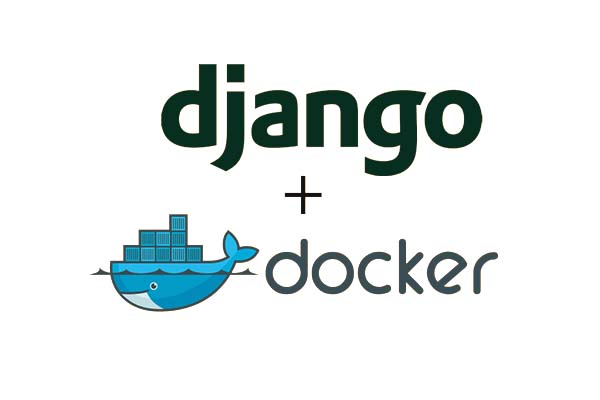

<!-- PROJECT LOGO -->
 

  

  <h3 align="center">Docker + Django Project</h3>

  

    A Django + Docker project made in order to learn about the proper Docker usage. 
    The idea is to fork and work on independent django apps.
    Tutorial: https://dev.to/gautamankul/dickerzing-a-python-django-web-app-on-ubuntu-21-04-54o7 by Gautam Ankul.
  

## Me: &nbsp;&nbsp;<a href="https://twitter.com/MorbidFace" target="_blank">Twitter</a>
